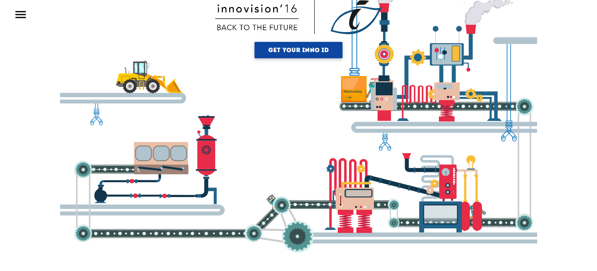
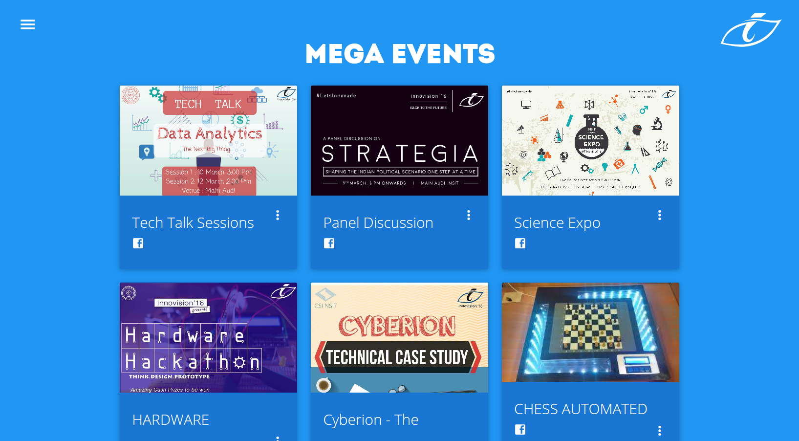

# Inno - A fest website

## [Preview](https://inno.boring.download/)

The site has been deployed using Heroku and MongoDB Atlas at <https://inno.boring.download/>

[](#Homepage)



## The site features the following functions :

1. Login/Register using FB and Local
2. Automatic generation of unique IDs for all users on successful registration (INNO-ID)
3. Admin and Event Manager(EM) accounts with special functions
4. Create events and update operations for EMs
5. Ability to register for events by users
6. View participants and export to Excel for EMs
7. Automatic mailing through Mailgun on registration
8. Mass mailing to all registered users through Mailgun

## Installation

### Requirements

- nodejs 14.x

    Check that you have node and npm(comes with node) successfully installed:

    ```sh
    node -v
    npm -v
    ```

- mongodb 4.4

    Follow the official instructions at:
    <https://docs.mongodb.com/manual/administration/install-community/>

### Steps

1. Clone the project using git and cd into it:

    ```sh
    git clone https://github.com/rohit-gohri/inno.git
    cd inno
    ```

1. Run npm install - this installs all the dependencies of the project (found in package.json) :

    ```sh
    npm install
    ```

## Config File

There is a `config/default.json` config file that provides default value 
Add a `production.json` and `development.json` file in the `config` directory. These files are used to store API keys and various other variable configurations like : site-url, contact-form-email, etc. Only add the things you want to overwrite in `default.json`.

It needs to have the following format :

```json
{
  "mailgun": {
    "auth": {
      "api_key": "<your-mailgun-api-key>",
      "domain": "<domain-registered-on-mailgun>"
    }
  },
  "url": "<domain-name-on-which-this-is-setup>",
  "hashids": {
    "secret": "<hash-secret-for-unique-id-generation>",
    "no_chars": 4,
    "chars": "ABCDEFGHIJKLMNOPQRSTUVWXYZ1234567890"
  },
  "contactEmail": "<email-for-contact-form>",
  "dbhost": "<mongodb-host-url",
  "sessionSecret": "<session-secret>",
  "fb": {
    "clientID": "<FB-app-id-for-login>",
    "clientSecret": "<fb-app-secret>",
    "callbackURL": "<site-url> + /login/fb/callback"
  }
}
```

### Mailgun API Key

This is used for sending emails. Signup and get your own key here: <https://www.mailgun.com/email-api/>

### FB Client ID and Secrets

This is used for Login with Facebook. Create your own app and get your own key here: <https://developers.facebook.com/docs/development/create-an-app/>

## Run

- Development (localhost) - this will read overrides from `config/development.json`

    ```sh
    npm run dev
    ```

- Development Watch Mode (uses nodemon)

    ```sh
    npm run dev:watch
    ```

- Production - this will read overrides from `config/production.json`

    ```sh
    npm run start
    ```

- Production PM2

    ```sh
    pm2 start ecosystem.config.js --env production
    ```

### Admin Access

To get access to admin panel, you'll have to manually mark a user as `is_admin: true` in the DB. 
You'll need [MongoDB Compass](https://www.mongodb.com/products/compass) or other similar tool for it.

<details>
 <summary>Click to expand detailed steps.</summary>

1. Connect to DB

	

2. Select `inno-site` DB

	

3. Select `accounts` collection

	

4. Set `is_admin: true` for the required user

	

5. After that if you go to profile you'll have these extra buttons (also a button to add other event managers)

	

6. And if you are an Admin or an Event Manager (EM) you'll get access to edit event details and see participant info on event page

	

</details>


## Contributors

### [Code](https://github.com/rohit-gohri/inno/graphs/contributors)

See Github Contributors: <https://github.com/rohit-gohri/inno/graphs/contributors>

### [Homepage](https://github.com/rohit-gohri/inno/tree/master/public/assets/robot)

#### Animations & Illustrations By [Utkarsh Yadav](https://github.com/utkarshyadav5): @utkarshyadav5
